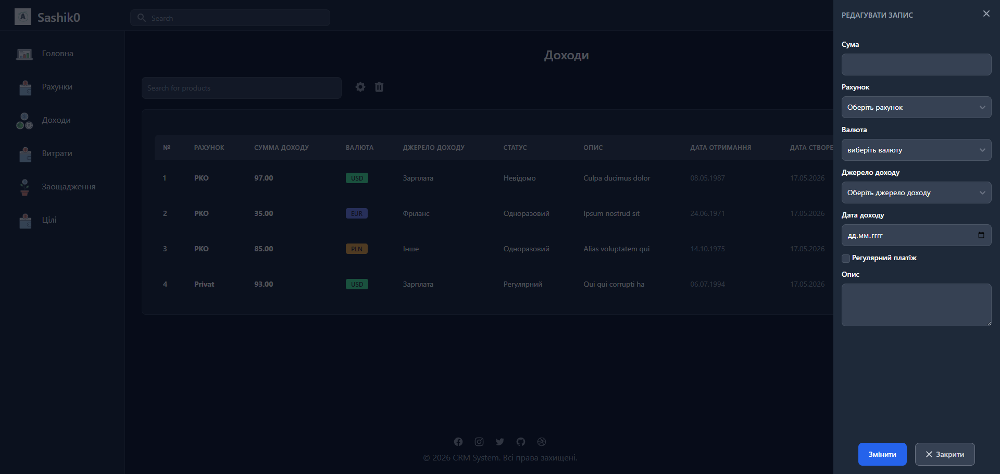
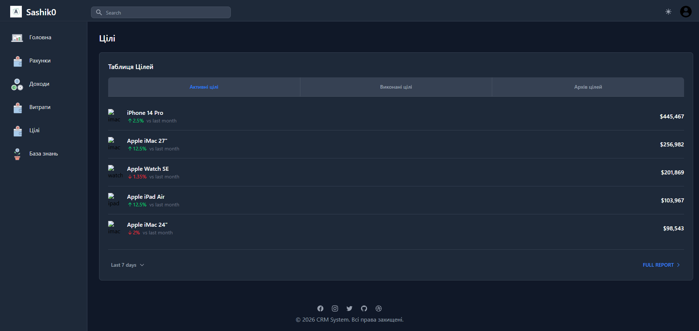
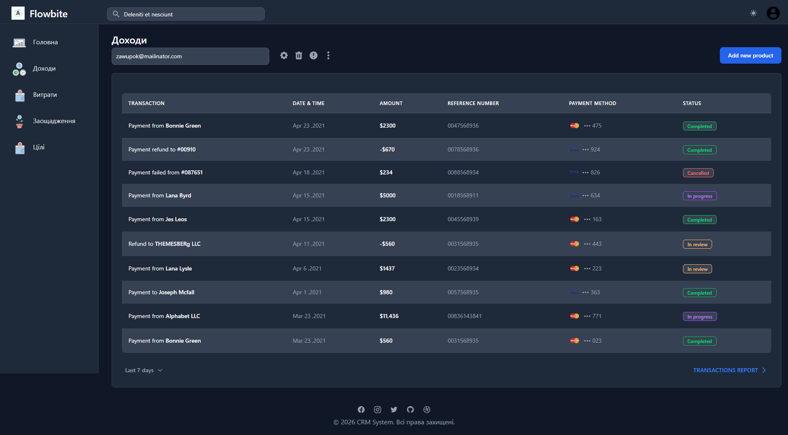

# 💸 Personal Finance Manager
 

A full-stack personal finance web application built with **Laravel**, **Blade**, and **Tailwind CSS** — tracking income, expenses, savings, and financial goals in one clean dark-mode interface.

---

## 📸 Screenshots

### Income tracking with slide-over form


### Goals dashboard


### Transaction history


### Add new income record


---

## ✨ Features

- 📊 **Income tracking** — log income with account, currency, source, and recurrence type
- 💸 **Expense tracking** — categorise and monitor all outgoing transactions
- 🏦 **Account management** — support for multiple accounts (Monobank, Privat, PKO, etc.)
- 💱 **Multi-currency** — USD, EUR, PLN, UAH supported out of the box
- 🎯 **Goals** — set savings targets with active / completed / archived tabs and progress indicators
- 🔐 **Authentication** — secure login and registration with per-user data isolation
- ✏️ **Slide-over forms** — smooth add / edit drawers without leaving the current page
- 🔍 **Search & filter** — find transactions quickly across all records
- ✅ **Form validation** — server-side validation via Laravel FormRequest
- 🌙 **Dark mode UI** — clean, modern dark interface built with Tailwind CSS
- 🚀 **CI/CD pipeline** — automated deployment via GitHub Actions

---

## 🛠️ Tech Stack

| Layer | Technology |
|---|---|
| Backend | PHP · Laravel |
| Frontend | Blade · Tailwind CSS · Vite |
| Database | MySQL |
| Auth | Laravel built-in Auth |
| Deployment | GitHub Actions |
| Version Control | Git |

---

## 🚀 Getting Started

### Requirements

- PHP >= 8.1
- Composer
- Node.js >= 18
- MySQL

### Installation

```bash
# Clone the repository
git clone https://github.com/Sashik0-ster/Laravel.react.git
cd Laravel.react

# Install PHP dependencies
composer install

# Install JS dependencies
npm install

# Set up environment
cp .env.example .env
php artisan key:generate

# Configure your database credentials in .env, then run:
php artisan migrate --seed

# Build frontend assets
npm run build

# Start local development server
php artisan serve
```

Open `http://localhost:8000` in your browser.

---

## 📁 Project Structure

```
app/
├── Http/
│   ├── Controllers/     # Business logic — Income, Expense, Goals, Accounts
│   └── Requests/        # FormRequest validation rules
├── Models/              # Eloquent ORM — Transaction, Account, Goal, Category
database/
├── migrations/          # Schema definitions
└── seeders/             # Sample data for development
resources/
└── views/               # Blade templates + Tailwind components
.github/
└── workflows/           # GitHub Actions CI/CD pipeline
```

---

## 🔒 Security

- All routes protected by Laravel's auth middleware
- Per-user data isolation — users can only access their own records
- CSRF protection on all forms
- Input sanitisation via FormRequest validation classes

---

## 📄 License

This project is open-source under the [MIT License](LICENSE).

---

> 🎓 **Learning project** — built to practise full-stack Laravel development hands-on: database design, multi-currency data modelling, Blade component architecture, and automated deployment pipelines.
>
> 🚧 **Work in progress** — the app is actively being developed. New features, refactors, and improvements are added regularly as skills grow.
